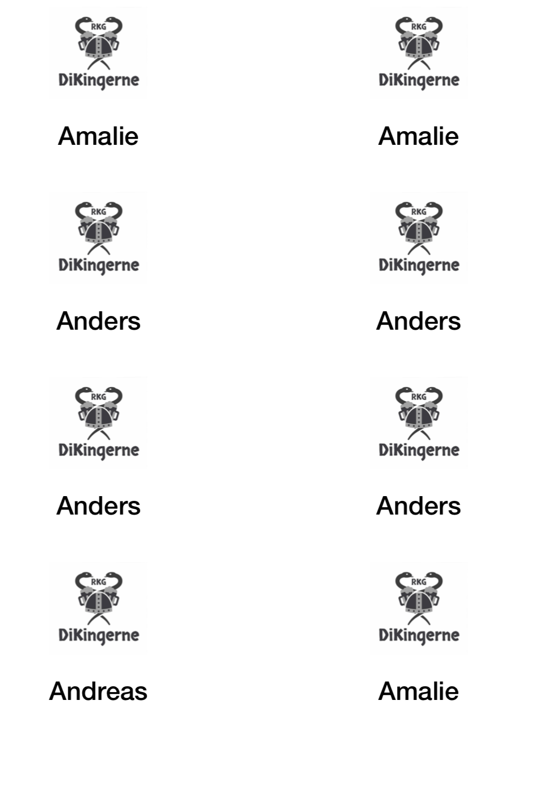

# Name tag generator.
A tool that generates pdfs containing printable name tags, split into groups
with the proper logo and separate pdfs based on subgroups that can be printed
on different colored paper.


The tool is made for tutors at [DIKU](http://diku.dk), our students are divided
into three large groups depending on which intro-trip there are goring on. Each
groups is then further divided into subgroups for each tutor.

## Format
The directory `logos` must contain the same number of logos as groups.
The syntax for names is
```csv
name, group, subgroup
Steve, 0, 0,
Adam, 0, 0,
Eve, 0, 1,
...
Alice, 1, 2,
```

## Installation and usage
To install the dopenendcies run the following commands (replace `pip3` with
`pip` if you have python3 as default or a virtual environment):
```bash
    pip install -r requirements.txt
    npm install -g html-pdf
```

The script can be run by:
```bash
    python generator.py
```
The pdfs will then be placed in the newly created `output` directory


## Framework
The pdf is first generated as a html file formatted using
[bootstrap](http://getbootstrap.com). The html file is generated by the python
templating language [Jinja2](http://jinja.pocoo.org), once the html files
has been generate the node module
[Node-html-pdf](https://github.com/marcbachmann/node-html-pdf) converts them
to pdfs. Lastly the tool [PyPDF2](https://github.com/mstamy2/PyPDF2) merges
the pdfs.
